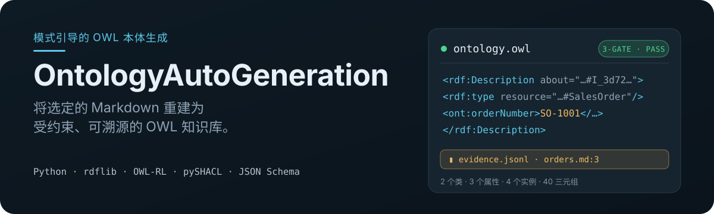
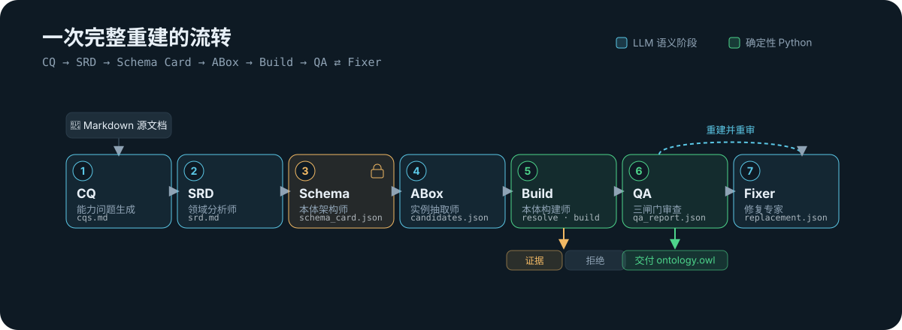

<p align="center">
  
</p>

<p align="center">
  <strong>面向 Codex 等编码 Agent 的 OWL 本体自动生成 Skill。</strong><br>
  <sub>把明确选定的 Markdown 重建为受约束、可审计、可恢复的 TBox + ABox。</sub>
</p>

<p align="center">
  <a href="#安装">安装</a> ·
  <a href="#使用">使用</a> ·
  <a href="#真实产出">真实产出</a> ·
  <a href="#工作原理">工作原理</a> ·
  <a href="#核心保证">核心保证</a> ·
  <a href="#owl-profile">OWL Profile</a> ·
  <a href="#文档">文档</a>
</p>

<p align="center">
  
  
  <a href="./LICENSE"></a>
</p>

---

**OntologyAutoGeneration** 是一个可安装的 [Agent Skill](https://agentskills.io/)。它指导 Agent 将你**明确选定**的 Markdown 文档完整重建为一份**受约束的 OWL 本体**——`ontology.owl`，其中包含锁定的模式（TBox）与被接纳的实例和断言（ABox）。

LLM 负责 CQ、SRD、Schema Card、ABox 和语义 QA；Skill 自带的确定性 Python 工具负责候选准入、身份解析、RDF/XML 序列化与验证。每个被接纳的事实附带原文证据旁路，每个拒绝都附带机器可读的原因。

## 安装

需要 Node.js 18+。使用开放 Agent Skills CLI 安装：

```bash
npx skills add Ma-benjiang/OntologyAutoGeneration/ontology-auto-generation
```

安装器会列出本机检测到的兼容 Agent 供你选择。Codex 用户也可以直接执行全局、非交互安装：

```bash
npx skills add Ma-benjiang/OntologyAutoGeneration/ontology-auto-generation \
  --global --agent codex --yes

python3 -m pip install -r ~/.codex/skills/ontology-auto-generation/requirements.txt
```

第一条命令负责安装 Skill；第二条命令补齐其确定性 Python 构建与验证依赖。该 Skill 遵循开放的 [`SKILL.md` 规范](https://agentskills.io/specification)，但当前主要在 Codex 中验证。

<details>
<summary><strong>从源码安装 / 开发</strong></summary>

```bash
git clone https://github.com/Ma-benjiang/OntologyAutoGeneration.git
cd OntologyAutoGeneration

python3 -m venv .venv
source .venv/bin/activate
python3 -m pip install -r ontology-auto-generation/requirements.txt
```

</details>

## 使用

在 Codex 的对话中直接点名 Skill（这不是终端命令）：

```text
$ontology-auto-generation
请根据 docs/requirements.md 和 docs/data-dictionary.md 生成 OWL 本体，
输出到 ontology-output/，并保留逐事实证据与拒绝原因。
```

也可以用自然语言描述同类任务，让 Codex 根据 Skill 的 `description` 自动匹配。建议在提示中明确：

- **来源**：一个或多个 workspace 内的 Markdown 文件；
- **输出目录**：本次重建产物写到哪里；
- **业务标识**：若文档中存在稳定 ID，说明其字段含义；
- **目标 IRI**：未指定时由流程生成中性的项目 IRI，不使用来源文档中的品牌域名。

Skill 会按 **CQ → SRD → Schema Card → ABox → Build → QA → Fixer** 执行完整重建，最终交付：

| 产物 | 说明 |
|---|---|
| `ontology.owl` | 唯一正式交付，包含 TBox + ABox |
| `evidence.jsonl` | 每个被接纳实体与事实的原文证据 |
| `rejections.jsonl` | 未接纳候选及机器可读原因 |
| `qa_report.json` | 语义、RDF、OWL-RL 与 SHACL 检查结果 |

它不是开放式三元组生成器：Schema Card 会先锁定允许的类、属性和数据类型，之后所有 ABox 候选都必须通过证据、身份、domain/range、XSD 和 OWL Profile 检查。

## 为什么使用它

- **Schema 先于事实。** 先生成并锁定 TBox，再在白名单约束下抽取 ABox，避免边抽取边漂移。
- **结果可重建。** 身份解析、事实准入和 RDF/XML 序列化由确定性 Python 执行，相同输入得到稳定结果。
- **审计不污染本体。** 原文证据与拒绝原因写入 JSONL 旁路，不向 OWL 注入自定义 provenance。
- **失败可解释、运行可恢复。** 候选不会被静默丢弃；运行状态、Release Snapshot 和 QA 结果均持久化。

| 适合 | 不适合 |
|---|---|
| 从业务 Markdown 构建受限的 OWL TBox + ABox | 通用 GraphRAG、聊天问答或图数据库服务 |
| 需要逐事实证据、拒绝原因和稳定实例身份 | 无约束开放信息抽取或概率式三元组堆叠 |
| 需要 RDF/XML、OWL-RL 与 SHACL 验证 | 完整 OWL 2 DL 推理或人工本体编辑器 |
| 需要完整重建、可恢复执行和可审计交付 | 增量缓存式知识图谱同步 |

## 本地验证与手动运行

### 验证确定性核心

下面的测试覆盖候选准入、稳定身份、RDF/XML 构建和确定性 OWL Profile 校验：

```bash
python3 -m unittest ontology-auto-generation/tests/test_ontology_pipeline.py -q
```

预期以 `OK` 结束。

### 启动一次完整重建

`run start` 只接受你显式指定的 workspace 内 Markdown，不会自动扫描目录：

```bash
PIPELINE=ontology-auto-generation/scripts/ontology_pipeline.py

python3 "$PIPELINE" run start \
  --workspace . \
  --output demo-output \
  --source CONTEXT.md

python3 "$PIPELINE" run status --output demo-output --json
```

这会创建可恢复的运行状态和第一个语义 Work Item。仓库本身不内置模型调用器；CQ、SRD、Schema Card、ABox、QA 与 Fixer 的语义结果由 LLM 按 [`ontology-auto-generation/SKILL.md`](./ontology-auto-generation/SKILL.md) 契约生成，再通过 `run submit` 提交。Python 会在每次状态推进前验证契约和输入摘要。

<details>
<summary><strong>查看完整运行生命周期命令</strong></summary>

```bash
# 提交当前语义 Work Item 的结果
python3 "$PIPELINE" run submit \
  --output demo-output \
  --work-item-id <id> \
  --input-digest <sha256> \
  --result <result-file>

# 崩溃后恢复，或主动中止
python3 "$PIPELINE" run resume --output demo-output
python3 "$PIPELINE" run abort  --output demo-output
```

开发调试时也可以直接调用 `resolve`、`build` 和 `validate.py`；完整参数和契约见 [Skill 操作手册](./ontology-auto-generation/SKILL.md)。

</details>

## 真实产出

下面是一组销售订单样例的实际产物摘录。最终交付 `ontology.owl` 同时包含 TBox 与 ABox：

```xml
<rdf:Description rdf:about="https://example.org/ontology/sales-order#I_3d72…1dbf">
  <rdf:type rdf:resource="https://example.org/ontology/sales-order#SalesOrder"/>
  <ont:orderNumber rdf:datatype="http://www.w3.org/2001/XMLSchema#string">SO-1001</ont:orderNumber>
  <ont:orderDate rdf:datatype="http://www.w3.org/2001/XMLSchema#date">2024-03-04</ont:orderDate>
</rdf:Description>
```

对应事实通过 `evidence.jsonl` 精确链接回来源，而不是写入本体：

```json
{
  "candidate_id": "orders.assertion.2",
  "candidate_kind": "assertion",
  "status": "admitted",
  "subject": "…sales-order#I_3d72…1dbf",
  "predicate": "…sales-order#orderDate",
  "object": "2024-03-04",
  "datatype": "http://www.w3.org/2001/XMLSchema#date",
  "evidence": {
    "source": "sales/orders.md",
    "heading_path": ["Sales Records"],
    "line_start": 3,
    "line_end": 3,
    "quote": "Customer Acme Corp placed order SO-1001 on 2024-03-04."
  }
}
```

最终 QA 报告汇总语义审查与确定性校验：

```text
Gate 1  语义忠实性与架构审查       PASS
Gate 2  RDF 语法 + OWL-RL          PASS
Gate 3  OWL bundle + SHACL         PASS
Delivery Status                    PASS
```

## 工作原理

<p align="center">
  
</p>

| # | 角色 | 产物 | 由谁驱动 |
|---|------|------|----------|
| 1 | CQ 生成器 | `cqs.md` | LLM |
| 2 | 领域分析师 | `srd.md` | LLM |
| 3 | 本体架构师 | `schema_card.json`（锁定） | LLM |
| 4 | 实例抽取师 | `abox_candidates.json`（实体 → 断言 → Critic） | LLM |
| 5 | 本体构建师 | `resolved_instances.json`、`*.owl` | **Python（确定性）** |
| 6 | QA 审查员 | `qa_report.json` | Gate 1 为 LLM · Gate 2–3 为 **Python** |
| 7 | 修复专家 | CQ / SRD / Schema Card 的完整替换 | LLM |

每次运行都是一次 **Full Rebuild**：抽取产物全部重新生成，不复用旧候选缓存。三个控制点决定最终结果：

1. **锁定 Schema Card。** TBox 与抽取白名单只有一个可信源。
2. **确定性准入与构建。** Python 验证来源、身份、类型和冲突，再序列化 OWL。
3. **QA / Fixer 闭环。** Gate 1 审查语义忠实性；Gate 2 检查 RDF 与 OWL-RL；Gate 3 校验 OWL bundle 与 SHACL。Fixer 只能完整替换 CQ、SRD 或 Schema Card 后重建，最多 20 轮。

## 核心保证

- **唯一可信源。** `schema_card.json` 是 TBox 与抽取白名单的唯一来源；OWL 始终由脚本派生，禁止手工编辑。
- **天然可审计。** 原文证据只写入 `evidence.jsonl`，拒绝原因只写入 `rejections.jsonl`，绝不作为注解写入本体。
- **保守身份。** 带业务标识符的 NamedIndividual 跨文档、跨重建稳定合并；无标识符的实体只在其来源范围内合并；绝不按同名跨文档合并。
- **严格 OWL Profile。** 不含 blank node、`owl:Restriction`、匿名类、RDF 集合、自定义注解或未声明谓语——见 [Profile](#owl-profile)。
- **可恢复运行。** 项目级短事务原子持久化状态；`resume` 只恢复通过 project/config/source/contract digest 校验的 staging。
- **交付状态明确。** 每次终态都发布内容寻址的 Release Snapshot，并区分 `PASS`、`FORCED_WITH_ERRORS` 与 `FAILED`。

## 产物目录

```text
output/
├── ontology.owl                 # 唯一正式交付：TBox + ABox
├── schema.owl                   # TBox 调试片段
├── instances.owl                # ABox 调试片段
└── artifacts/
    ├── cqs.md
    ├── srd.md
    ├── schema_card.json         # TBox / 抽取白名单的唯一可信源
    ├── abox_candidates.json
    ├── resolved_instances.json
    ├── evidence.jsonl           # 被接纳实体/断言的原文证据
    ├── rejections.jsonl         # 拒绝原因
    ├── qa_report.json
    └── qa_rounds/
```

只有 `ontology.owl` 包含唯一的 `owl:Ontology` 声明；`schema.owl` 与 `instances.owl` 仅用于调试。

## OWL Profile

| 允许 | 禁止 |
|------|------|
| 一个 `owl:Ontology`（仅 `ontology.owl`） | `owl:oneOf`、`owl:Restriction`、匿名类 |
| `owl:Class`、`owl:ObjectProperty`、`owl:DatatypeProperty` | RDF 集合、blank node |
| `owl:NamedIndividual` + 类型 / 属性断言 | `owl:AnnotationProperty` / 自定义注解谓语 |
| `rdfs:label`、`rdfs:comment` | functional / cardinality / union / intersection 语义 |
| `subClassOf`、`subPropertyOf`、`inverseOf`、`equivalentClass/Property`、`domain`、`range`、`disjointWith` | 未在 Schema Card 中声明的任何类/属性/实例谓语 |
| 与 Schema Card range 完全一致的 XSD typed literal | 本体内的证据、置信度或来源路径 |

枚举采用“枚举父类 + 值类子类 + ObjectProperty”——枚举值绝不作为业务实例生成。详见 [`references/owl-best-practices.md`](./ontology-auto-generation/references/owl-best-practices.md)。

## 仓库结构

```text
.
├── ontology-auto-generation/        # 工具 + LLM Skill
│   ├── SKILL.md                      # 七角色操作手册
│   ├── scripts/                      # ontology_pipeline.py · validate.py · chunk_contract.py · xsd_profile.py
│   ├── references/                   # JSON-Schema 契约 + OWL 约束形状
│   └── tests/                        # 黄金样例 + 生命周期 / 契约测试
├── docs/
│   ├── adr/                          # 身份与重建相关决策
│   └── research/
├── CONTEXT.md                        # 领域术语表（TBox / ABox / Schema Card / …）
└── assets/readme/                    # hero + 流水线示意图
```

## 文档

- [**受控词表**](./CONTEXT.md) —— Ontology Project、TBox/ABox View、Schema Card、Canonical Entity、Release Snapshot 等领域术语。
- [**架构决策**](./docs/adr/) —— 本体身份、术语身份复用与保守实例身份解析。
- [**Skill 操作手册**](./ontology-auto-generation/SKILL.md) —— 七个角色、严格 JSON 契约、身份规则、QA 与可恢复运行。
- [**研究记录**](./docs/research/) —— 同类项目、技术选型与 README 信息架构调研。

## 开发与贡献

运行完整测试集：

```bash
python3 -m unittest discover -s ontology-auto-generation/tests -v
```

提交改动前请保持现有契约、黄金样例与生命周期测试通过。问题与改进建议可提交到 [GitHub Issues](https://github.com/Ma-benjiang/OntologyAutoGeneration/issues)，代码改动可通过 Pull Request 讨论。

## 致谢

本项目的实现设计参考了以下优秀开源项目：

- [OntoCast](https://github.com/growgraph/ontocast) —— 文档分块、critic 循环、跨块实体对齐与失败单元处理。
- [myKG](https://github.com/SenolIsci/mykg) —— 全局 Schema → 实例抽取的两阶段流程、白名单校验与稳定标识。
- [brains-group/towards_automated_ontology_generation](https://github.com/brains-group/towards_automated_ontology_generation) —— CQ → SRD → Schema → OWL → QA/Fixer 的多角色流程，以及 RDF 语法与逻辑校验。
- [OntoRAG](https://github.com/ontorag/ontorag) 与 [Docling Graph](https://github.com/docling-project/docling-graph) —— Schema Card、身份字段、确定性合并与溯源账本。
- [OntoGPT](https://github.com/monarch-initiative/ontogpt) 与 [Text2KGBench](https://github.com/cenguix/Text2KGBench) —— Schema 约束抽取、span grounding、ontology conformance 与幻觉评测维度。

核心实现直接使用 [RDFLib](https://github.com/RDFLib/rdflib)、[OWL-RL](https://github.com/RDFLib/OWL-RL)、[pySHACL](https://github.com/RDFLib/pySHACL) 与 [jsonschema](https://github.com/python-jsonschema/jsonschema)，分别承担 RDF 构建、推理、SHACL 和 JSON Schema 验证。感谢上述项目及其贡献者。

具体实现参考点、差异与未采用部分见 [技术调研](./docs/research/github-tbox-abox-llm-projects.md)。本项目为独立实现，不声明与上述项目兼容，也不代表其官方背书。

## 许可证

本项目基于 [MIT License](./LICENSE) 开源，可自由使用、复制、修改与分发，但需保留原版权和许可声明。
